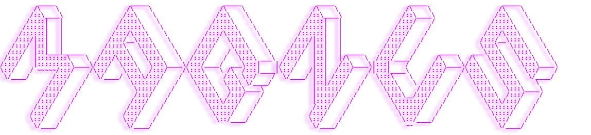

  

<h1 align="center">Hi , I'm Magnus 👨‍🦳🥱</h1>
<h2 align="center">Frontend developer student from Sweden ❄️ ☃️ 🇸🇪</h2>

  

 
#

<a href="https://linkedin.com/in/https://www.linkedin.com/in/magnus-vahlstrom/" target="blank">
 </a>

 

#

<h3 align="center">Languages and extra:</h3>

  

  

 
&nbsp;

<h3 align="center">Tools:</h3>

  

  <a href="https://www.inkscape.com/" target="_blank" rel="noreferrer">   
  
   

 

 
&nbsp;

<h3 align="center">Spare time:</h3>

  
 

 

